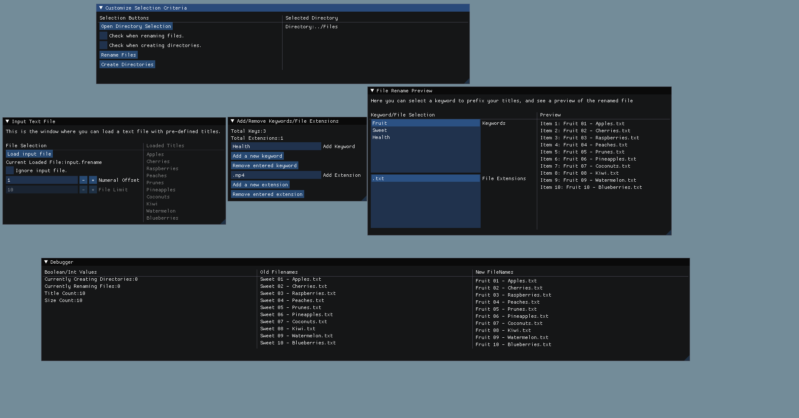

# Author Information
Name: Thierno Diallo  
Date: April 2021  
Email: Tdial3280@gmail.com  

# File-Rename
File-Rename is a small project that focuses on creating a tool that allows users to rename files or create
directories in a specified folder.  



# Table Of Contents
1. [Motivation](#Motivation)
2. [Features](#Features)
3. [Intended Use](#Intended_Use)
4. [Compiling](#Compiling)  
5. [External_Libraries](#External_Libraries/Tools)  
6. [License](#License)


# Motivation
I started working on this project after getting tired of the tedium that came with managing a large amount
of files on a daily basis. So I decided to write this program to make it a little more convenient for me to
manage those files. I had initially wrote this program as a simple Python script, but wanted to have more
customizable options when it came to handling files. Hence I created this program.    


# Features
The program allows users to load in an input file with a list of words. Those words are then combined together
along with other values to create a human readable filename. You can also create a set amount of empty directories
in a specified folder. 


# Intended Use
Currently the program only works on Linux machines and Windows machines that can run the windows subsystem.
The program is designed with simple renaming/directory creation in mind. So if you're looking for something
with more complex features I suggest trying a different program.  

# Compiling
The program uses [CMake](https://cmake.org/) for compiling. Here is a simple example:
````
"your terminal path"$ mkdir build
"your terminal path"$ cd build
"your terminal path"$ cmake ..  
"your terminal path"$ make  
"your terminal path"$ out/FileRename  
````
All of the CMake dependent files will be put into the "build" folder along with the executable.  


# External Libraries/Tools
The following libraries are used in this program:  
- [ImGui](https://github.com/ocornut/imgui)  
- [Boost](https://www.boost.org/)  
- [OpenGL](https://www.opengl.org//)  
- [SDL](https://www.libsdl.org/)
- [Doxygen](https://www.doxygen.nl/index.html)


# License
This program is licensed under the MIT License. See "LICENSE" for more details.