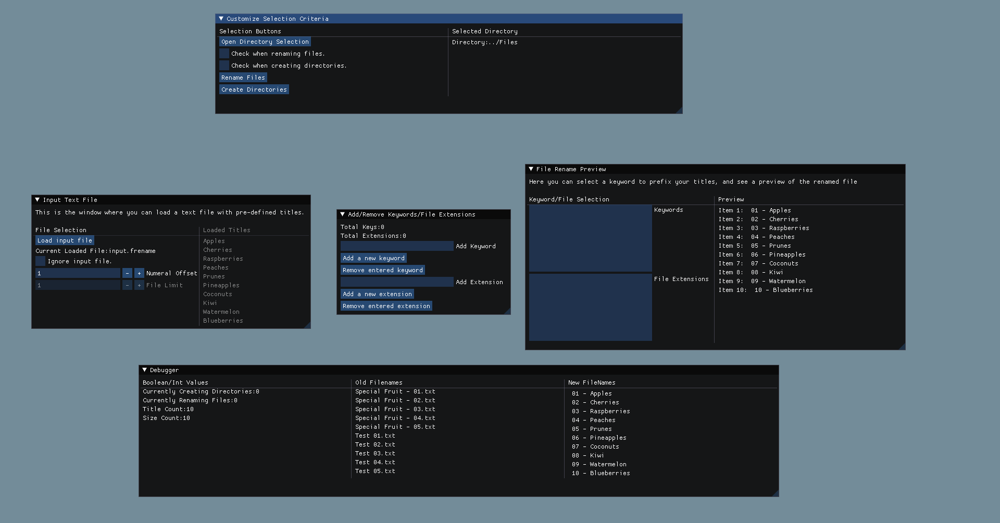

# Author Information
Name: Thierno Diallo  
Date: April 2021  
Email: Tdial3280@gmail.com  

# File-Rename
File-Rename is a small project that focuses on creating a tool that allows users to rename files or create
directories in a specified folder.  
  


# Table Of Contents
1. [Motivation](#Motivation)
2. [Features](#Features)
3. [Demo](#Demo)
4. [Intended Use](#Intended_Use)
5. [Constraints](#Constraints)
6. [Compiling](#Compiling)  
7. [External_Libraries](#External_Libraries/Tools)  
8. [License](#License)


# Motivation
I started working on this project after getting tired of the tedium that came with managing a large amount
of files on a daily basis. So I decided to write this program to make it a little more convenient for me to
manage those files. I had initially wrote this program as a simple Python script, but wanted to have more
customizable options when it came to handling files. Hence I created this program.    


# Features
## Input Files
![][Documentation/Input-File.gif]  
The program can load in input files with the extension ".frename" which is a custom extension that I made up. The input
files are just simple text files where each word is separated by line. A sample file is included in the repository for your
reference.

## Keywords & Extensions
![][Documentation/Keywords-Extensions.gif]  
You can prefix the titles you give in an input file with special keywords. As well as denote what file extension you would
like the renamed file to end with. You can add up to 10 of each. Also note that the length of a keyword and extension cannot
be more than 50 characters.

## Ignoring Input Files
![][Documentation/Ignoring-Input.gif]  
If you prefer to not use titles to rename your files you can choose to ignore them and use keywords instead.

## Numeral Offset
![][Documentation/Numerals.gif]  
The rename files are given a numeral value based on when they appear in the input file. This numeral value can be changed
if you are simply adding to a group of files that you have already renamed.

# Demo
![][Documentation/Demo.gif]  

# Intended_Use
Currently the program only works on Linux machines and Windows machines that can run the windows subsystem.
The program is designed with simple renaming/directory creation in mind. So if you're looking for something
with more complex features I suggest trying a different program.

# Constraints
- You cannot individual select a set amount of files to rename. The program will add all of the files it can find
in a given directory.  
- You cannot filter files to load by extension so I'd recommend organizing your folders to have only 1 type of extension.  
- I'd recommend to not play around with your file explorer while you are trying to rename programs. Such as deleting files that
are already loaded and prepped to rename. You risking possibly overwriting a file with an unintended name. 

# Compiling
The program uses [CMake](https://cmake.org/) for compiling. Here is a simple example:
````
"your terminal path"$ mkdir build
"your terminal path"$ cd build
"your terminal path"$ cmake ..  
"your terminal path"$ make  
"your terminal path"$ out/FileRename  
````
All of the CMake dependent files will be put into the "build" folder along with the executable.  


# External_Libraries/Tools
The following libraries are used in this program:  
- [ImGui](https://github.com/ocornut/imgui)  
- [Boost](https://www.boost.org/)  
- [OpenGL](https://www.opengl.org//)  
- [SDL](https://www.libsdl.org/)
- [Doxygen](https://www.doxygen.nl/index.html)


# License
This program is licensed under the MIT License. See "LICENSE" for more details.